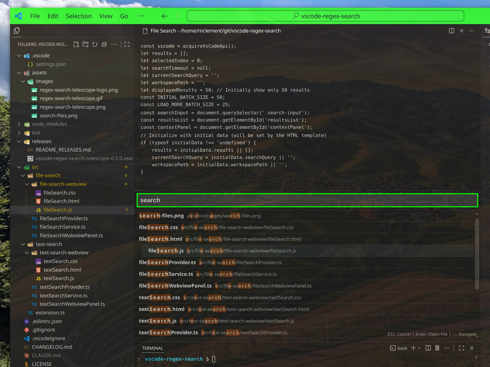

# QuickFind - VSCode Extension

  

A fast and intuitive search extension for Visual Studio Code, inspired by vim telescope. 
Provides powerful text search and file search capabilities with a clean split-pane interface.

## Preview

## Functions

### 🔍 Search Current File
**Keybinding**: `Ctrl+K Ctrl+T` (Windows/Linux) / `Cmd+K Cmd+T` (macOS)

Search within the currently active file with real-time regex matching and highlighting.

### 🔍 Search Workspace
**Keybinding**: `Ctrl+K Ctrl+G` (Windows/Linux) / `Cmd+K Cmd+G` (macOS)

Search across all files in your workspace with blazing-fast performance.

### 📁 Search Files
**Keybinding**: `Ctrl+K Ctrl+F` (Windows/Linux) / `Cmd+K Cmd+F` (macOS)

Fuzzy search for files in your workspace. Find files by name with intelligent matching and see file metadata in the context panel.

## Configuration

### Context Size
**`quickFind.contextSize`** (number, default: 7)

Controls how many lines of context are shown around each search result. Set the number of lines to show before and after each match (0-20). This setting controls both the content displayed in the context panel and its height, adapting automatically to show more or less context as needed.

### Search Performance Options

- **`quickFind.maxFileSize`** (string, default: "1MB"): Maximum file size for search operations. Supports units like '500KB', '1MB', '2GB'.
- **`quickFind.maxResults`** (number, default: 1000): Maximum number of search results to display (1-10000).

## Requirements

- **VSCode**: Version 1.74.0 or higher

## Customizing Keyboard Shortcuts

You can customize the keyboard shortcuts for this extension:

1. Open VS Code settings (`Ctrl+,` or `Cmd+,`)
2. Go to **Keyboard Shortcuts** (`Ctrl+K Ctrl+S` or `Cmd+K Cmd+S`)
3. Search for "QuickFind" to find the extension commands
4. Click the pencil icon next to any command to change its keybinding
5. Set your preferred key combination

**Available commands:**
- `QuickFind: Search in Current File` (default: `Ctrl+K Ctrl+T` / `Cmd+K Cmd+T`)
- `QuickFind: Search in Current Folder` (default: `Ctrl+K Ctrl+G` / `Cmd+K Cmd+G`)
- `QuickFind: Search Files` (default: `Ctrl+K Ctrl+F` / `Cmd+K Cmd+F`)

---

For installation instructions, changelog, detailed usage, development setup, releases, and contribution guidelines, see [README_DEVELOPERS.md](README_DEVELOPERS.md).
